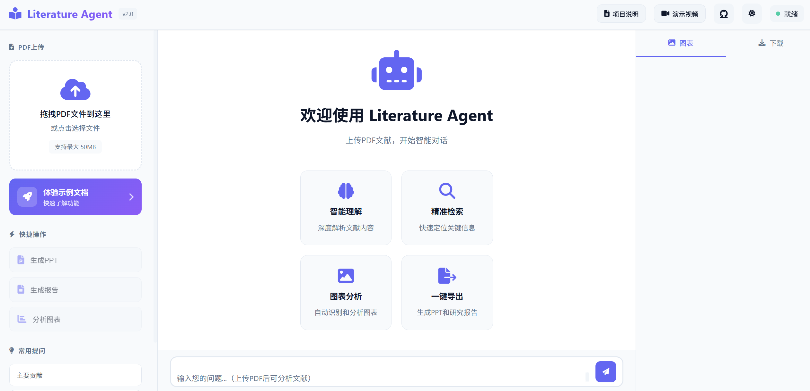
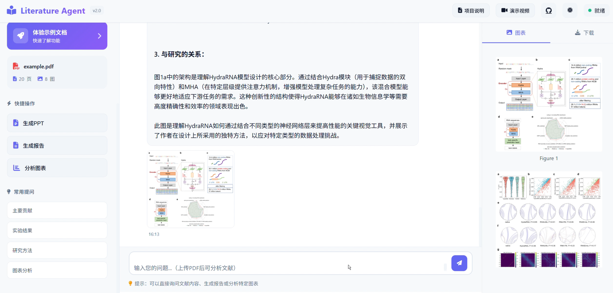
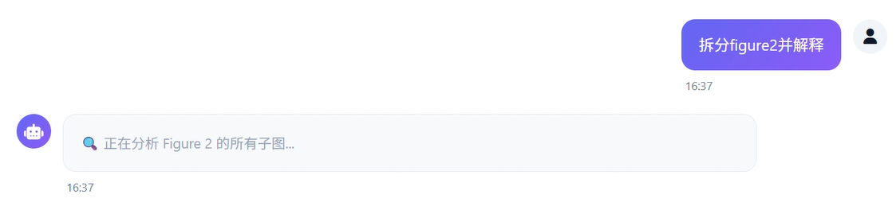
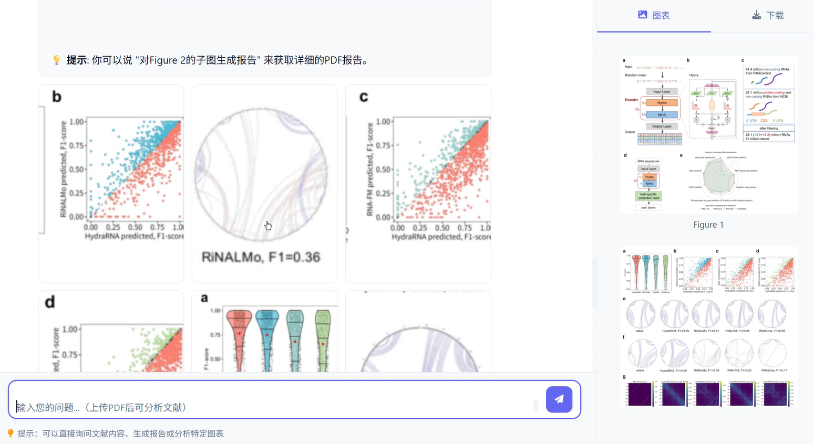
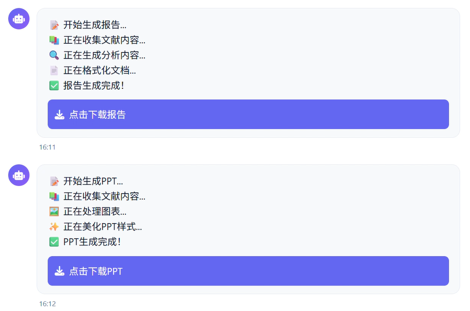
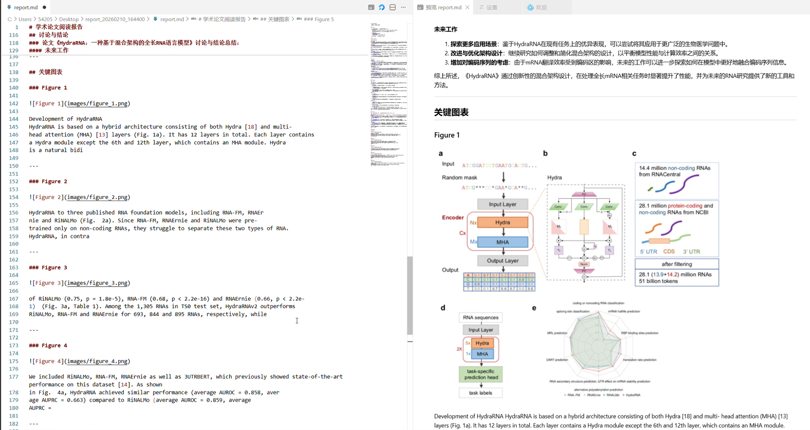
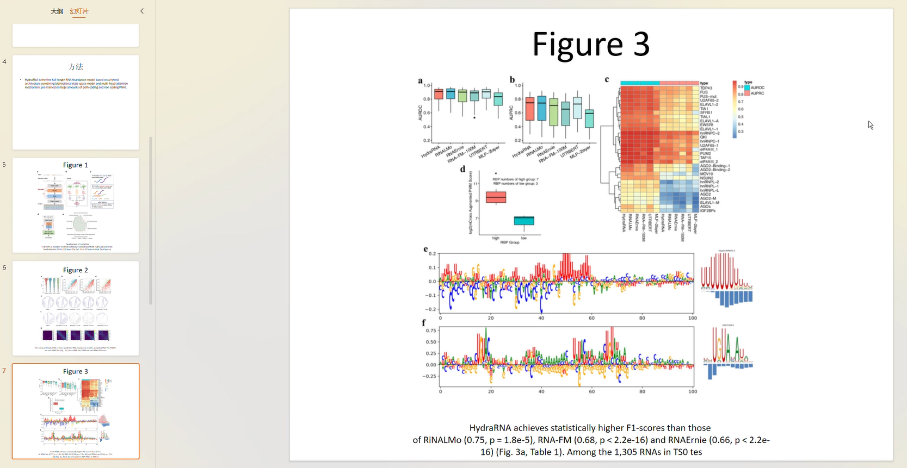
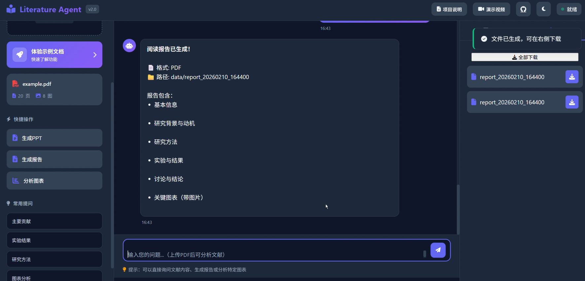

# 🤖Literature Agent - 智能文献阅读助手📑

- **参赛队伍**：三只小狗中的两只队
- **参赛队员**：林诗逸（浙江大学）；李婷（南京大学）
  

<figure align="center">
  <figcaption style="text-align: center;">
    智能体交互页面
  </figcaption>
</figure>


## 📚 项目简介

Literature Agent 是一个基于大语言模型的智能Agent系统，专为研究人员设计的文献阅读助手。本项目整合了PyMuPDF、python-pptx、FastAPI等多个开源工具，通过模块化架构实现了PDF解析、图表提取、智能问答和文档生成的完整工作流。

系统采用多Agent协作设计（文献理解、图像识别、子图拆分、文档/PPT生成），能够自主调用合适的工具链完成复杂任务。支持Ollama、OpenAI、Anthropic等多种LLM后端，既可本地部署保护隐私，也可使用云端API。通过集成figure-separator和多模态视觉模型（LLaVA/GPT-4 Vision/Claude Vision），实现了从图文智能匹配到子图级精细分析的完整能力。

#### 核心价值

- **智能理解**：基于LLM的深度语义理解，准确回答文献相关问题
- **图像识别**：自动提取并分析论文中的图表，支持子图级别的精细分析
- **报告生成**：一键生成PPT演示文稿和研究报告，节省整理时间
- **本地部署**：兼容Ollama本地大模型，保护数据隐私


## 🎯 功能特性

### 1. 智能文献解析

- **PDF自动解析**：上传PDF后自动提取文本和图表
- **结构化存储**：按页面组织内容，便于检索和引用
- **图表提取**：智能识别并提取论文中的所有Figure
- **实时反馈**：解析进度实时显示，用户体验流畅


<figure align="center">
  <figcaption style="text-align: center;">
    智能体自动识别文献图片
  </figcaption>
</figure>

### 2. 高级图表分析

#### 主图展示
- 上传即显示所有主图
- 侧边栏统一管理
- 点击放大查看

#### 子图分割
- **智能检测**：基于CNN模型自动检测复合图中的子图
- **按需分割**：用户询问时才进行分割，提升性能
- **实时进度**：分割过程实时显示进度和结果
- **降级方案**：无CNN模型时使用基础方法，保证功能可用

#### 支持的查询方式
```
"分析Figure 1"           → 显示并分析主图
"Figure 2a展示了什么？"   → 自动分割并分析子图a  
"图3子图c"               → 中文支持
"分析所有图表"           → 批量分析
```



<figure align="center">
  <figcaption style="text-align: center;">
    智能体自动识别子图并进行拆分
  </figcaption>
</figure>


### 3. 文档自动生成

<p align="center">
  
</p>


#### 研究报告
- **结构化输出**：包含摘要、方法、结果、结论等章节
- **图表整合**：自动插入并标注图表
- **可定制**：支持自定义报告模板

<p align="center">
  
</p>
<figure align="center">
  <figcaption style="text-align: center;">
    智能体输出的Markdown格式阅读报告
  </figcaption>
</figure>


#### PPT生成
- **智能排版**：自动提取关键内容生成幻灯片
- **图表嵌入**：自动插入相关图表
- **实时进度**：生成过程可视化

<p align="center">
  
</p>
<figure align="center">
  <figcaption style="text-align: center;">
    智能体输出的文献总结PPT
  </figcaption>
</figure>

### 4. 用户体验优化

#### 侧边栏管理
- **图表栏**：展示所有主图和子图，可滚动查看
- **下载栏**：累积显示所有生成的文件
- **深色/浅色主题**：自适应系统偏好
- **Markdown渲染**：支持标题、列表、代码等格式

<p align="center">
  
</p>
<figure align="center">
  <figcaption style="text-align: center;">
    支持切换深色主题 / 侧边栏显示待下载文件列表
  </figcaption>
</figure>

---

## 🏗️ 技术架构

### 系统架构

```
┌─────────────────────────────────────────────┐
│              前端 (Web UI)                   │
│    - Vue.js-like 响应式设计                  │
│    - 实时流式响应                            │
│    - 文件管理与下载                          │
└──────────────────┬──────────────────────────┘
                   │ HTTP/SSE
┌──────────────────▼──────────────────────────┐
│           后端 (FastAPI)                     │
│    - RESTful API                            │
│    - 流式响应处理                            │
│    - 异步任务管理                            │
└──────────────────┬──────────────────────────┘
                   │
        ┌──────────┴──────────┐
        │                     │
┌───────▼────────┐   ┌────────▼────────┐
│  Agent层        │   │  Parser层        │
│  - SmartAgent  │   │  - PDF解析       │
│  - PPTAgent    │   │  - 图表提取      │
│  - ReportAgent │   │  - 子图分割      │
│  - SubfigAgent │   └─────────────────┘
└───────┬────────┘
        │
┌───────▼────────┐
│  LLM层          │
│  - Ollama      │
│  - OpenAI      │
│  - Anthropic   │
└────────────────┘
```

### 核心模块

#### 1. PDF解析
- **库**: PyMuPDF (fitz)
- **功能**: 文本提取、图片提取、页面分析
- **优化**: 分页存储、增量解析

#### 2. 子图分割器
- **CNN模型**: figure-separator
- **降级方案**: OpenCV基础方法
- **特性**: 置信度过滤、标签自动生成

#### 3. LLM接口
- **多provider支持**: Ollama、OpenAI、Anthropic
- **统一接口**: chat() 和 stream_chat()

#### 4. 意图路由
- **正则匹配**: 识别Figure编号、子图标记
- **智能分发**: 路由到不同的处理Agent
  - SmartAgent（核心理解）
  - SubfigureAgent（子图专家）
  - ReportAgent（文档生成）
  - PPTAgent（PPT生成）
- **上下文管理**: 维护对话状态

#### 5. 文档生成
- **PPT**: python-pptx，支持主题和模板
- **Word**: python-docx，结构化文档生成
- **Markdown**: 纯文本格式，易于编辑

---

## 💻 技术栈

### 后端
- **框架**: FastAPI 0.104+
- **LLM**: Ollama / OpenAI / Anthropic
- **PDF**: PyMuPDF (fitz)
- **图像**: OpenCV, Pillow
- **文档**: python-pptx, python-docx
- **配置**: TOML

### 前端
- **原生**: HTML5 + CSS3 + JavaScript (ES6+)
- **样式**: CSS Variables (主题系统)
- **图标**: Font Awesome 6
- **通信**: Fetch API + Server-Sent Events

### 开发工具
- **版本控制**: Git
- **包管理**: pip, conda
- **代码规范**: PEP 8
- **文档**: Markdown


---

## 📦 快速开始

### 环境要求
- Python 3.10+
- Ollama (可选，用于本地模型)
- 4GB+ RAM
- 2GB+ 磁盘空间

### 安装步骤

```bash
# 1. 克隆项目
git clone https://github.com/your-repo/literature-agent.git
cd literature-agent

# 2. 安装依赖
pip install -r requirements.txt

# 3. 配置 (可选)
cp config/config.toml.example config/config.toml
# 编辑 config.toml 设置你的LLM provider

# 4. 启动Ollama (如果使用本地模型)
ollama serve
ollama pull qwen2.5:14b

# 5. 启动应用
python app.py

# 6. 访问
# 打开浏览器访问 http://localhost:7860
```

### 配置示例

```toml
[llm]
provider = "ollama"  # 或 "openai", "anthropic"

[llm.ollama]
base_url = "http://localhost:11434"
model = "qwen2.5:14b"
vision_model = "llava:7b"

[system]
data_dir = "./data"
auto_split_figures = false  # 按需分割
```

---

## 📄 开源协议

本项目采用 MIT License 开源协议。

---

## 📧 联系方式

- **Github主页**: https://github.com/IveGotMagicBean/literature-agent-V2
- **魔搭社区地址**: https://modelscope.cn/studios/ShiyiLin0922/PaperAgent/summary
- **邮箱**: 542058929@qq.com

---

## 🙏 致谢

感谢以下开源项目的支持：
- FastAPI
- PyMuPDF
- python-pptx & python-docx
- Ollama
- figure-separator

感谢AI Hackathon Tour提供参赛机会
感谢ModelScope魔搭社区提供项目部署平台


<figure align="center">
  <figcaption style="text-align: center;">
    <b>Literature Agent - 让文献阅读更智能！<b/> 📚✨
  </figcaption>
</figure>