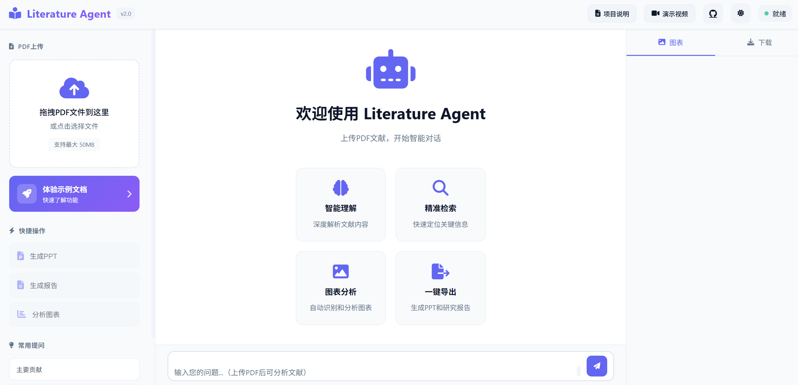
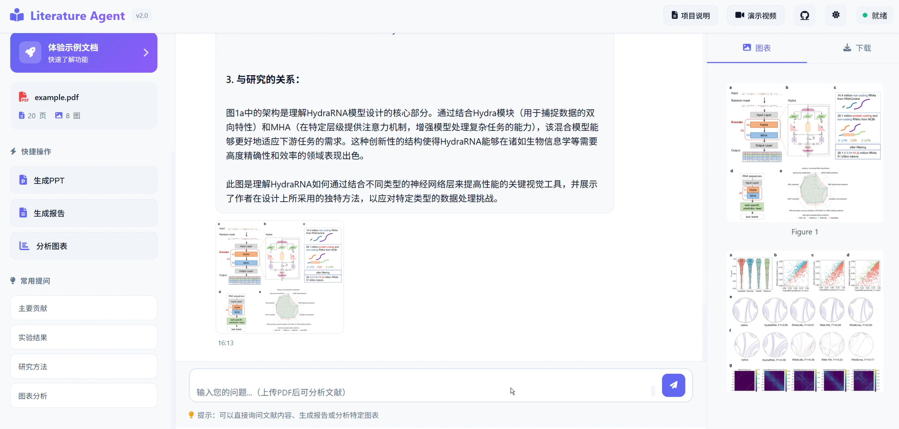
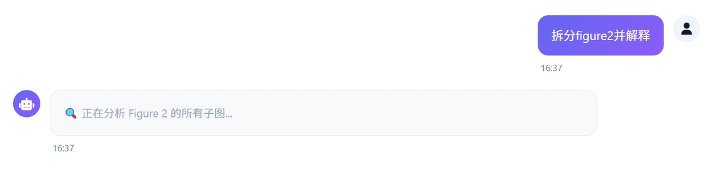
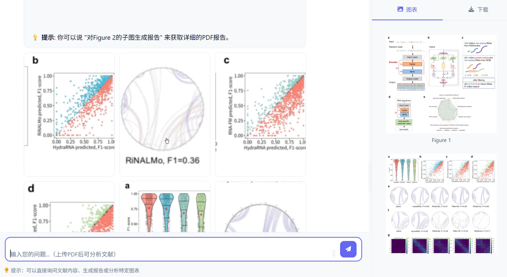
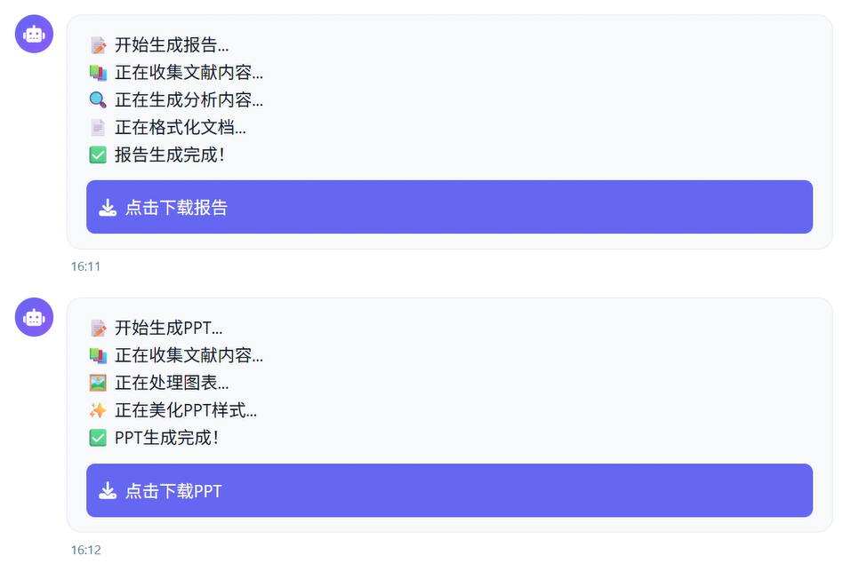
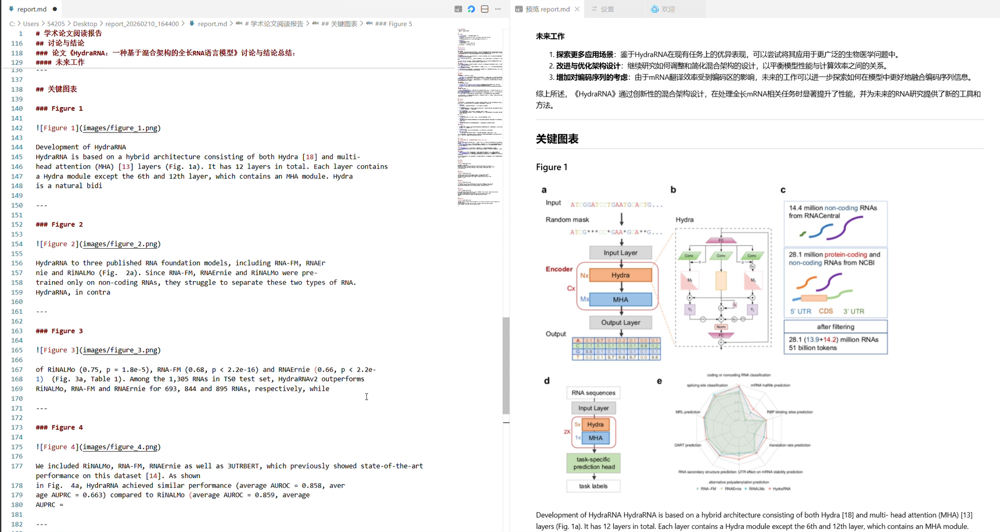
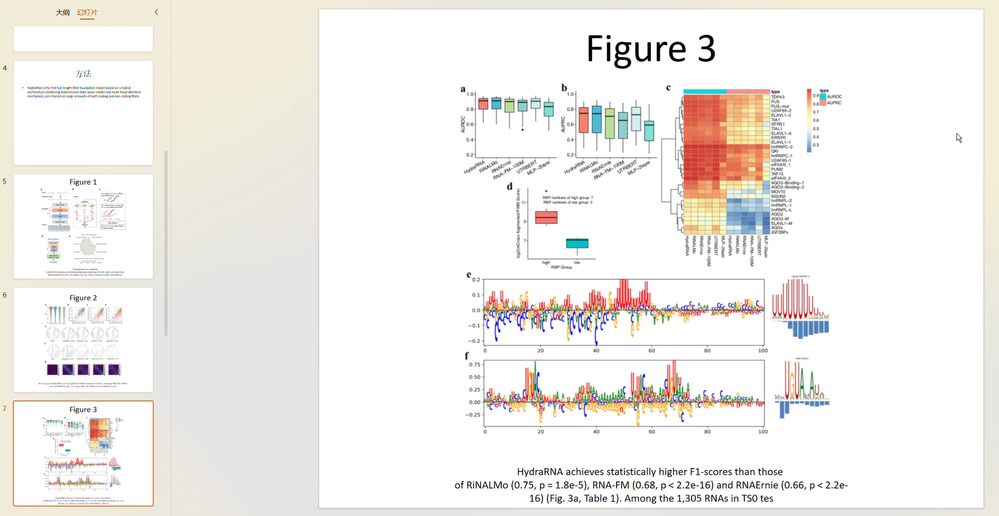
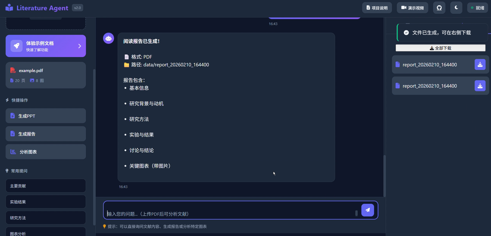

# 🤖 Literature Agent — AI科研协作引擎

> 面向复杂学术场景的多模态知识自动化系统


- **作者**：林诗逸

🌐 **项目主页**：<!-- TODO: 填入项目主页链接 -->  
🎬 **演示视频**：<!-- TODO: 填入视频链接 -->  
🚀 **在线体验**：https://shiny-glitter-e495.542058929.workers.dev/
📦 **GitHub**：https://github.com/IveGotMagicBean/literature-agent-V2


<figure align="center">
  <figcaption style="text-align: center;">智能体交互页面</figcaption>
</figure>

---

## 📚 项目简介

Literature Agent 是一个基于多Agent协作架构的**智能科研文献阅读助手**，面向研究人员在论文阅读、图表理解和知识整理中的真实痛点，提供从 **PDF 解析 → 图表智能识别 → 子图语义拆分 → 跨模态问答 → 报告/PPT一键生成** 的完整知识自动化工作流。

- **多模态深度理解**：不仅提取文本，更用视觉大模型（qwen-vl-max / LLaVA）真正"看懂"图表，支持子图级别的精细语义分析
- **多Agent智能协作**：SmartAgent（核心理解）、SubfigureAgent（子图专家）、ReportAgent（报告生成）、PPTAgent（演示文稿）通过意图路由器自动调度
- **多LLM后端弹性切换**：支持阿里云DashScope、OpenAI、Anthropic、Ollama，云端高性能与本地隐私保护自由选择

---

## 🎯 功能特性

### 1. 智能文献解析

- **PDF自动解析**：上传PDF后自动提取全文文本与图表
- **智能图片匹配**：基于文本引用（而非提取顺序）匹配Figure编号，避免顺序混乱
- **实时反馈**：解析进度实时流式显示


<figure align="center">
  <figcaption style="text-align: center;">智能体自动识别文献图片</figcaption>
</figure>

### 2. 视觉图表分析

- **真正"看图"**：调用视觉大模型直接分析图片内容，而非仅依赖文字描述
- **子图智能分割**：基于 figure-separator CNN 模型自动检测复合图边界，按需触发，节省资源
- **优雅降级**：无视觉模型时自动切换纯文本模式；无CNN模型时使用OpenCV基础方法

支持的查询方式：

```
"分析Figure 1"           → 视觉模型直接分析主图
"Figure 2a展示了什么？"   → 自动分割并视觉分析子图a
"图3子图c"               → 中文自然语言支持
"分析所有图表"           → 批量分析
```



<figure align="center">
  <figcaption style="text-align: center;">智能体自动识别子图并进行拆分</figcaption>
</figure>

### 3. 文档自动生成

<p align="center">
  
</p>

#### 研究报告
- 结构化章节：摘要、方法、结果、结论
- 自动插入并标注图表
- 支持 PDF / Word / Markdown 多格式输出

<p align="center">
  
</p>
<figure align="center">
  <figcaption style="text-align: center;">智能体输出的结构化阅读报告</figcaption>
</figure>

#### PPT生成
- 智能提取关键内容，自动排版生成幻灯片
- 自动嵌入相关图表，适合组会汇报

<p align="center">
  
</p>
<figure align="center">
  <figcaption style="text-align: center;">智能体输出的文献总结PPT</figcaption>
</figure>

### 4. 用户体验

- **输出打断**：流式生成过程中可随时点击红色停止按钮中断
- **侧边栏管理**：图表栏 + 下载栏统一管理，可滚动查看
- **深色/浅色主题**：自适应系统偏好
- **Markdown渲染**：支持标题、列表、代码等富文本格式
- **流式响应**：实时显示LLM生成过程

<p align="center">
  
</p>
<figure align="center">
  <figcaption style="text-align: center;">深色主题 & 侧边栏文件管理</figcaption>
</figure>

---

## 🏗️ 技术架构

```
┌──────────────────────────────────────────────────┐
│              前端 (Web UI)                         │
│    HTML5 + CSS3 + JavaScript (ES6+)               │
│    Server-Sent Events 流式响应 · AbortController  │
└──────────────────┬───────────────────────────────┘
                   │ HTTP / SSE
┌──────────────────▼───────────────────────────────┐
│              后端 (FastAPI)                        │
│    RESTful API · 异步处理 · 文件管理               │
└──────────────────┬───────────────────────────────┘
                   │
     ┌─────────────┼─────────────┐
     │             │             │
┌────▼─────┐ ┌────▼─────┐ ┌────▼──────┐
│  Agent层  │ │ Parser层  │ │ Generator │
│ Smart    │ │ PDF解析   │ │ PPT模板   │
│ Intent   │ │ 图表提取  │ │ 报告格式  │
│ Subfig   │ │ 子图分割  │ └───────────┘
│ Report   │ └───────────┘
│ PPT      │
└────┬─────┘
     │
┌────▼──────────────────────────────────────┐
│            LLM 统一接口层                   │
│  DashScope · OpenAI · Anthropic · Ollama  │
│  文本对话 · 流式输出 · 图像分析 · 重试机制  │
└───────────────────────────────────────────┘
```

| 模块 | 技术 | 功能 |
|------|------|------|
| PDF解析 | PyMuPDF (fitz) | 文本提取、图片提取、页面分析 |
| 子图分割 | figure-separator + OpenCV | CNN检测 + 基础方法降级 |
| LLM接口 | OpenAI SDK (兼容模式) | 多Provider、流式、重试、视觉 |
| 意图路由 | 正则 + 关键词 | 自动识别并分发到对应Agent |
| 文档生成 | python-pptx / python-docx / reportlab | PPT、Word、PDF、Markdown |

---

## 💻 技术栈

**后端**：FastAPI · OpenAI SDK · PyMuPDF · OpenCV · Pillow · python-pptx · python-docx · reportlab

**前端**：HTML5 · CSS3 · JavaScript (ES6+) · Font Awesome · SSE · AbortController

**LLM**：DashScope (通义千问) · OpenAI · Anthropic · Ollama

---

## 📦 本地部署

### 环境要求

- Python 3.10+
- 4GB+ RAM
- 阿里云 DashScope API Key（推荐）或其他 LLM 服务

### 方式一：一键安装（推荐）

```bash
git clone https://github.com/IveGotMagicBean/literature-agent-V2.git
cd literature-agent-V2

bash scripts/install.sh
```

脚本会自动安装依赖、检测 LLM 配置，并询问是否立即启动。

### 方式二：手动安装

```bash
# 1. 克隆
git clone https://github.com/IveGotMagicBean/literature-agent-V2.git
cd literature-agent-V2

# 2. 安装依赖
pip install -r requirements.txt

# 3. 配置
cp config/config.toml.example config/config.toml
vim config/config.toml   # 填入 API Key

# 4. 创建目录
mkdir -p data/example uploads

# 5. 启动
python app.py
# 访问 http://localhost:7860
```

### 方式三：本地开发（自动 venv）

```bash
bash scripts/start_local.sh
```

### 配置说明

**阿里云 DashScope（推荐，中文能力强）：**

```toml
[llm]
provider = "dashscope"

[llm.dashscope]
api_key = "sk-xxxxxxxxxxxxxxxx"   # https://bailian.console.aliyun.com 获取
base_url = "https://dashscope.aliyuncs.com/compatible-mode/v1"
model = "qwen-plus"
vision_model = "qwen-vl-max"     # 图表视觉分析必须
```

**OpenAI：**

```toml
[llm]
provider = "openai"
api_key = "sk-xxxxxxxxxxxxxxxx"
model = "gpt-4o"
```

**本地 Ollama：**

```toml
[llm]
provider = "ollama"

[llm.ollama]
base_url = "http://localhost:11434"
model = "qwen2.5:14b"
vision_model = "llava:7b"
```

### 示例文档与演示视频（可选）

```bash
# 放一篇 PDF 论文作为首页示例文档
cp 你的论文.pdf data/example/example.pdf

# 放演示视频（首页播放按钮）
cp 你的视频.mp4 static/demo.mp4
```

### 集群部署（SLURM）

```bash
sbatch app.sh               # 启动主程序（端口 7860）
sbatch scripts/ngrok.sh     # ngrok 内网穿透（对外暴露端口）
sbatch scripts/ollama.sh    # Ollama 本地模型服务（使用本地模型时）
```

---

## 📁 项目结构

```
literature-agent/
├── app.py                   # 主程序入口
├── app.sh                   # SLURM 提交脚本
├── requirements.txt
├── config/
│   ├── config.toml          # 配置文件（需自行创建）
│   └── config.toml.example
├── src/
│   ├── agents/              # Smart / Subfigure / Report / PPT Agent
│   ├── api/                 # FastAPI 路由
│   ├── core/                # LLM 工厂 / 应用状态
│   ├── parsers/             # PDF 解析 / 图片提取 / 子图分割
│   ├── generators/          # PPT 模板
│   └── matching/            # 文本-图片匹配
├── static/
│   ├── index.html
│   ├── js/app.js
│   ├── css/style.css
│   └── demo.mp4             # 演示视频（自行放入）
├── data/
│   └── example/example.pdf  # 示例文档（自行放入）
├── uploads/                 # 用户上传（运行时生成）
└── scripts/
    ├── install.sh           # 一键安装
    ├── start_local.sh       # 本地开发启动
    ├── ngrok.sh             # ngrok 内网穿透
    ├── ollama.sh            # Ollama 服务
    └── dev/                 # 开发调试工具
```

---

## 📄 开源协议

MIT License

---

## 📧 联系方式

- **GitHub**：https://github.com/IveGotMagicBean/literature-agent-V2
- **邮箱**：542058929@qq.com

---

## 🙏 致谢

感谢以下开源项目：FastAPI · PyMuPDF · python-pptx · python-docx · Ollama · figure-separator


<figure align="center">
  <figcaption style="text-align: center;">
    <b>Literature Agent — 让文献阅读更智能！</b> 📚✨
  </figcaption>
</figure>
